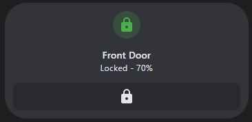

# Service Call Tile Feature

[![GitHub Release][releases-shield]][releases]
[![License][license-shield]](LICENSE.md)
[](https://github.com/custom-components/hacs)
![Project Maintenance][maintenance-shield]
[![GitHub Activity][last-commit-shield]][commits]
[![Community Forum][forum-shield]][forum]

[![Github][github]][github]

[](https://my.home-assistant.io/redirect/hacs_repository/?repository=service-call-tile-feature&owner=Nerwyn&category=Plugin)

Call any service via a tile button, with no restrictions on the tile entity type.

[The Home Assistant developers gave us the ability to create custom tile features](https://developers.home-assistant.io/docs/frontend/custom-ui/custom-card/#tile-features), why is no one else taking advantage of it?

This custom tile feature will let you do whatever you want with tile card button features.

## Options

| Name           | Type   | Description/Value                                                                                                                                                  |
| -------------- | ------ | ------------------------------------------------------------------------------------------------------------------------------------------------------------------ |
| type           | string | `custom:service-call`                                                                                                                                              |
| service        | string | The service call to make, like `light.toggle` or `lock.unlock`.                                                                                                    |
| data           | string | Additional data to pass to the service call. See the Home Assistant documentation or go to `Developer Tools > Services` to see available options for each service. |
| data.entity_id | string | The entity ID of the device to call the service on. If left blank will use the entity ID assigned to the tile card.                                                |

## Examples

### A lock button

```yaml
type: tile
entity: lock.front_door_ble
show_entity_picture: false
vertical: true
features:
  - type: custom:service-call
    service: script.toggle_front_door
    icon: mdi:lock
card_mod:
  style:
    ha-tile-info$: |
      .secondary:after {
        visibility: visible;
        content: " - {{ states('sensor.front_door_battery_level') }}%";
      }
```



[last-commit-shield]: https://img.shields.io/github/last-commit/Nerwyn/service-call-tile-feature?style=for-the-badge
[commits]: https://github.com/Nerwyn/service-call-tile-feature/commits/main
[forum-shield]: https://img.shields.io/badge/community-forum-brightgreen.svg?style=for-the-badge
[forum]: https://community.home-assistant.io/t/
[license-shield]: https://img.shields.io/github/license/Nerwyn/service-call-tile-feature.svg?style=for-the-badge
[maintenance-shield]: https://img.shields.io/badge/maintainer-Nerwyn-blue.svg?style=for-the-badge
[releases-shield]: https://img.shields.io/github/release/Nerwyn/service-call-tile-feature.svg?style=for-the-badge
[releases]: https://github.com/nerwyn/service-call-tile-feature/releases
[github]: https://img.shields.io/github/followers/Nerwyn.svg?style=social
