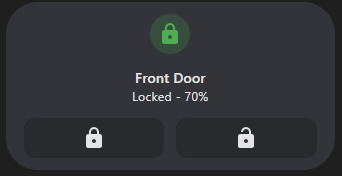
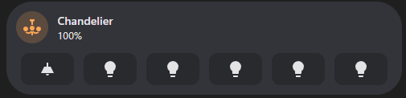

# Service Call Tile Feature

[![GitHub Release][releases-shield]][releases]
[![License][license-shield]](LICENSE.md)
[](https://github.com/custom-components/hacs)
![Project Maintenance][maintenance-shield]
[![GitHub Activity][last-commit-shield]][commits]
[![Community Forum][forum-shield]][forum]

[![Github][github]][github]

[](https://my.home-assistant.io/redirect/hacs_repository/?repository=service-call-tile-feature&owner=Nerwyn&category=Plugin)

Call any service via a tile button. This custom tile feature will let you do whatever you want with tile card buttons. [The Home Assistant developers gave us the ability to create custom tile features](https://developers.home-assistant.io/docs/frontend/custom-ui/custom-card/#tile-features), why is no one else taking advantage of it? And why isn't something like a generic service call tile button already in Home Assistant? I don't know but here it is.

## Options

### Base Config

| Name    | Type   | Description/Value                                  |
| ------- | ------ | -------------------------------------------------- |
| type    | string | `custom:service-call`                              |
| buttons | array  | List of buttons to include in a tile features row. |

### Button Config

| Name           | Type   | Description                                                                                                                                                        |
| -------------- | ------ | ------------------------------------------------------------------------------------------------------------------------------------------------------------------ |
| service        | string | The service call to make, e.g. `light.toggle` or `lock.unlock`.                                                                                                    |
| data.entity_id | string | The entity ID of the device to call the service on. If left blank will use the entity ID assigned to the tile card.                                                |
| data           | string | Additional data to pass to the service call. See the Home Assistant documentation or go to `Developer Tools > Services` to see available options for each service. |
| color          | string | Custom color for the button. Should either be a color name like `red` or an rgb function like `rgb(255 0 0)`                                                       |
| opacity        | float  | Opacity of the button background. Should be a number between 0 and 1. Defaults to 0.2.                                                                             |
| icon_color     | string | Custom color of                                                                                                                                                    |

## Examples

### A lock tile with lock and unlock buttons

```yaml
type: tile
entity: lock.front_door_ble
show_entity_picture: false
vertical: true
features:
  - type: custom:service-call
    buttons:
      - service: lock.lock
        icon: mdi:lock
      - service: lock.unlock
        icon: mdi:lock-open
card_mod:
  style:
    ha-tile-info$: |
      .secondary:after {
        visibility: visible;
        content: " - {{ states('sensor.front_door_battery_level') }}%";
      }
```



### A light tile with a button for each bulb

```yaml
type: tile
entity: light.chandelier
features:
  - type: custom:service-call
    buttons:
      - service: light.toggle
        icon: mdi:ceiling-light
      - service: light.toggle
        icon: mdi:lightbulb
        data:
          entity_id: light.chandelier_bulb_1
      - service: light.toggle
        icon: mdi:lightbulb
        data:
          entity_id: light.chandelier_bulb_2
      - service: light.toggle
        icon: mdi:lightbulb
        data:
          entity_id: light.chandelier_bulb_3
      - service: light.toggle
        icon: mdi:lightbulb
        data:
          entity_id: light.chandelier_bulb_4
      - service: light.toggle
        icon: mdi:lightbulb
        data:
          entity_id: light.chandelier_bulb_5
  - type: custom:service-call
    buttons:
      - service: light.turn_on
        color: red
        icon_color: rgb(255 0 0)
        icon: mdi:alpha-r
        data:
          color_name: red
      - service: light.turn_on
        color: green
        icon_color: rgb(0 255 0)
        icon: mdi:alpha-g
        data:
          color_name: green
      - service: light.turn_on
        color: blue
        icon_color: rgb(0 0 255)
        icon: mdi:alpha-b
        data:
          color_name: blue
      - service: light.turn_on
        color: white
        icon_color: rgb(255 255 255)
        icon: mdi:alpha-w
        data:
          color_temp: 500
```



[last-commit-shield]: https://img.shields.io/github/last-commit/Nerwyn/service-call-tile-feature?style=for-the-badge
[commits]: https://github.com/Nerwyn/service-call-tile-feature/commits/main
[forum-shield]: https://img.shields.io/badge/community-forum-brightgreen.svg?style=for-the-badge
[forum]: https://community.home-assistant.io/t/
[license-shield]: https://img.shields.io/github/license/Nerwyn/service-call-tile-feature.svg?style=for-the-badge
[maintenance-shield]: https://img.shields.io/badge/maintainer-Nerwyn-blue.svg?style=for-the-badge
[releases-shield]: https://img.shields.io/github/release/Nerwyn/service-call-tile-feature.svg?style=for-the-badge
[releases]: https://github.com/nerwyn/service-call-tile-feature/releases
[github]: https://img.shields.io/github/followers/Nerwyn.svg?style=social
